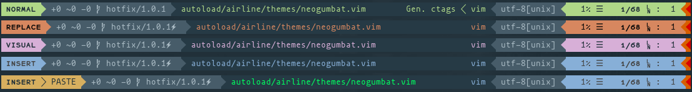

# neogumbat.vim

Neogumbat is a theme for [Vim Airline] combining [Bubblegum], [Neodark] and [Wombat], intended for use with [Neodark.vim].

It was created as a custom theme to fix some issues with the default [Neodark] theme when `g:neodark#terminal_transparent`
was enabled with `:set notermguicolors`, causing [Vim Airline] text to be difficult to read due to the background being unset.

Neogumbat was designed to work with the Oceanic Next colour scheme for [Alacritty]. YMMV with other schemes/terminals.



## Installation

Neogumbat can be installed with your favourite plugin manager. For [vim-plug], your vimrc might look something like this:

```vim
call plug#begin('~/.vim/plugged')
    Plug 'KeitaNakamura/neodark.vim'
    Plug 'dshoreman/neogumbat.vim'
    Plug 'vim-airline/vim-airline'
call plug#end()

let g:airline_theme = 'neogumbat'
let g:airline_powerline_fonts = 1

let g:neodark#terminal_transparent = 1
let g:neodark#solid_vertsplit = 1

colorscheme neodark
```

## Alacritty Tweaks

If you're using [Alacritty], there's a good chance you won't have `:set termguicolors` in order to get support for transparency.

In that case, you'll need the following colour overrides in your `~/.config/alacritty/alacritty.yml`:

```yaml
colors:
  indexed_colors: [
    { index: 59, color: '0x475C69' },
    { index: 236, color: '0x1f2f38' },
    { index: 237, color: '0x263a45' },
    { index: 245, color: '0x658595' },
    { index: 250, color: '0xaabbc4' },
  ]
```

Without the overrides above, the theme will still work but will likely be a bit on the grey side.

[Alacritty]: https://github.com/jwilm/alacritty
[Vim Airline]: https://github.com/vim-airline/vim-airline
[vim-plug]: https://github.com/junegunn/vim-plug
[Bubblegum]: https://github.com/vim-airline/vim-airline-themes/blob/1eecd5b1c02c88ad2f8303757f453e2d7f0bd414/autoload/airline/themes/bubblegum.vim
[Neodark]: https://github.com/KeitaNakamura/neodark.vim/blob/c966731b54a64b379ca5519c25d3cedb90df1d31/autoload/airline/themes/neodark.vim
[Neodark.vim]: https://github.com/KeitaNakamura/neodark.vim
[Wombat]: https://github.com/vim-airline/vim-airline-themes/blob/1eecd5b1c02c88ad2f8303757f453e2d7f0bd414/autoload/airline/themes/wombat.vim
